# 📚 AttendanceManager

<div align="center">


A modern, responsive attendance management application built with **React** and **Firebase** to help students effortlessly track attendance, monitor eligibility, and stay organized throughout the semester.

</div>

---

## ✨ Features

### 📅 Attendance Tracking

- Mark lectures as:
  - ✅ Present
  - ❌ Absent
  - 🟢 Free Lecture
  - ⚪ Cancelled
- Subject-wise attendance statistics
- Automatic attendance percentage calculation
- Daily attendance logging

---

### 📊 Attendance Analytics

- Overall attendance dashboard
- Interactive attendance graphs using Recharts
- Weekly attendance trends
- Subject-wise attendance breakdown
- Attendance history visualization

---

### 🎯 75% Attendance Calculator

Automatically calculates:

- Current attendance percentage
- Classes required to reach 75%
- Classes that can safely be skipped
- Real-time updates after every attendance entry

---

### 📆 Timetable Management

- Create semester timetable
- Weekly lecture scheduling
- Edit timetable anytime
- Holiday support
- Automatic lecture generation based on timetable

---

### 🗓 Calendar View

- Monthly attendance calendar
- Attendance history
- Holiday indicators
- Daily lecture summary
- PDF attendance export

---

### ⚡ Quick Attendance

- Fast popup attendance marking
- One-click lecture updates
- Optimized for mobile devices

---

### 🔔 Smart Reminders

- Lecture reminders
- Browser notifications
- Attendance alerts
- Custom reminder scheduling

---

### ☁ Cloud Sync

- Google Authentication
- Firebase Firestore
- Secure cloud backup
- Automatic synchronization across multiple devices
- Access your attendance anywhere after signing in

---

### 🌙 Modern UI

- Responsive design
- Dark & Light themes
- Smooth animations
- Mobile-first interface

---

# 🚀 Tech Stack

| Technology | Purpose |
|------------|---------|
| React | Frontend |
| React Router | Routing |
| Firebase Authentication | User Login |
| Cloud Firestore | Database |
| Framer Motion | Animations |
| Recharts | Charts & Analytics |
| jsPDF | PDF Export |
| html2canvas | PDF Screenshot Generation |

---

# 📂 Project Structure

```text
src/
│
├── components/
│   ├── AttendanceOverviewChart
│   ├── MobileNav
│   ├── Modal
│   ├── Navbar
│   ├── OverallAttendanceModal
│   ├── QuickTodayAttendance
│   ├── ReminderScheduler
│   ├── ThemeToggle
│   └── NotificationPermissionModal
│
├── pages/
│   ├── Home
│   ├── Today
│   ├── Calendar
│   ├── Auth
│   └── OnboardingSetup
│
├── context/
│   ├── AuthContext
│   ├── SemesterContext
│   └── ThemeContext
│
├── firebase/
│   ├── config
│   └── firestoreService
│
├── hooks/
│   └── useNotificationPermission
│
├── store/
│   └── attendanceStore
│
├── utils/
│   ├── attendanceUtils
│   └── timetableUtils
│
└── data/
    └── defaultSemesters
```

---

---

---

# 📸 Application Preview

> 🎬 **Demo**
>
> *(Demo GIF coming soon.)*

---

## 🔐 Authentication

Secure email/password and Google Sign-In using Firebase Authentication.

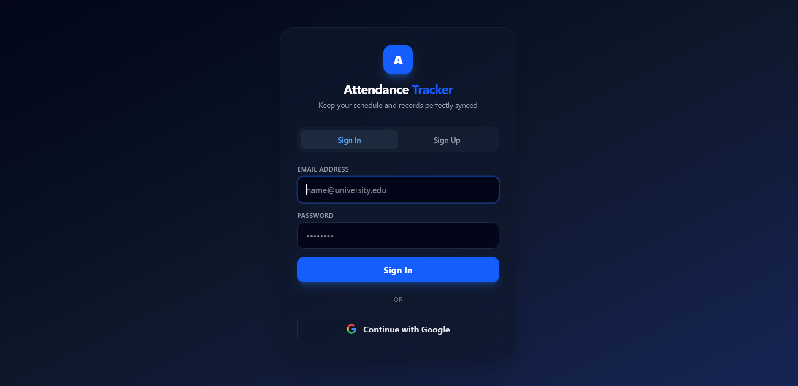

---

## 🏠 Dashboard

A modern dashboard with support for both **Light** and **Dark** themes.

### 🌞 Light Theme

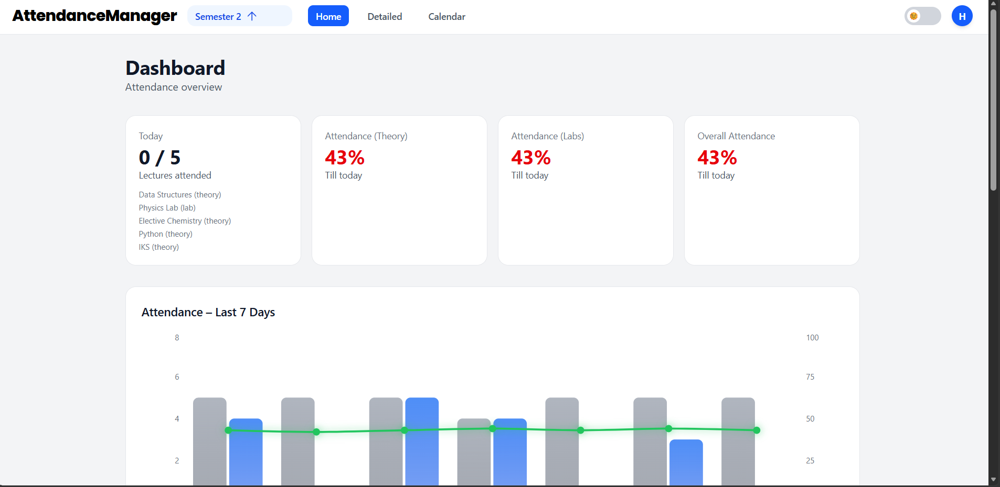

### 🌙 Dark Theme

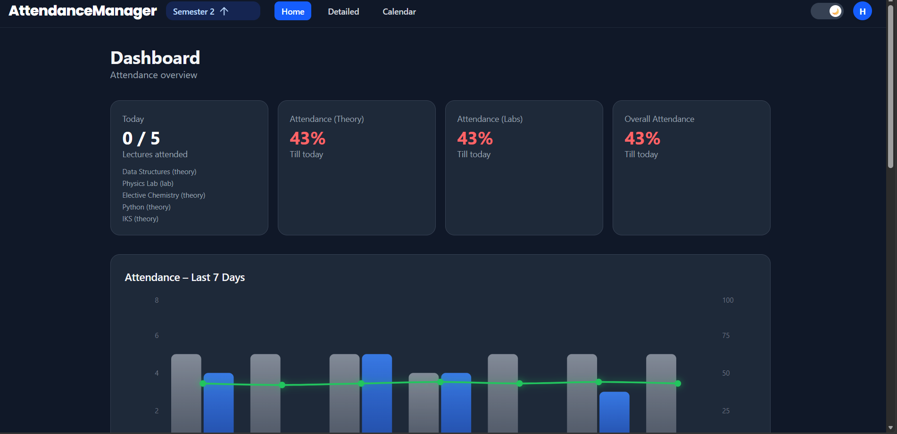

---

## 📊 Attendance Analytics

Track attendance over the last 7 days with interactive graphs showing:

- Lectures conducted
- Lectures attended
- Overall attendance percentage

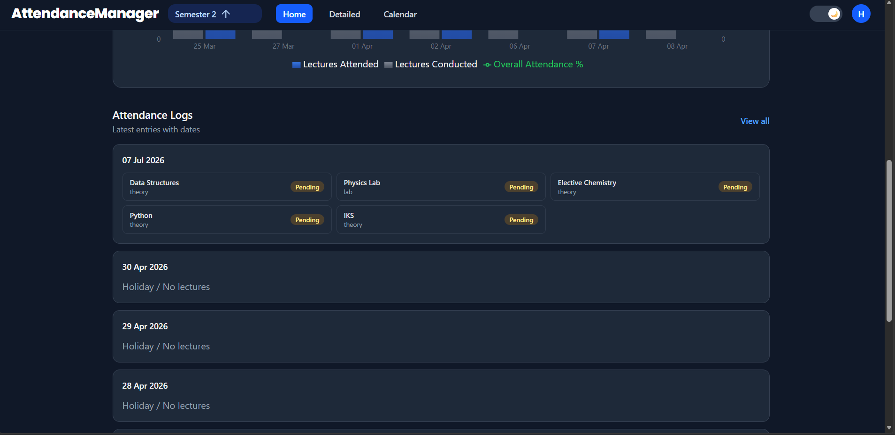

---

## 📚 Subject-wise Attendance

Monitor every subject separately with attendance percentage, risk indicators, and detailed lecture statistics.

### Theory Subjects

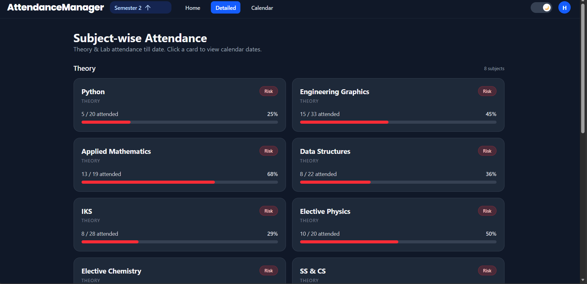

### Lab Subjects

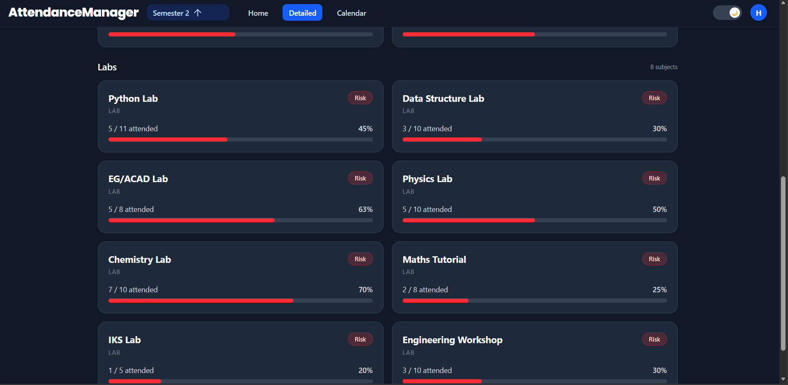

---

## 📅 Subject Attendance History

Click any subject to view its complete attendance calendar with Present, Absent, Free, Cancelled, Holiday, Exam Day, and No Data statuses.

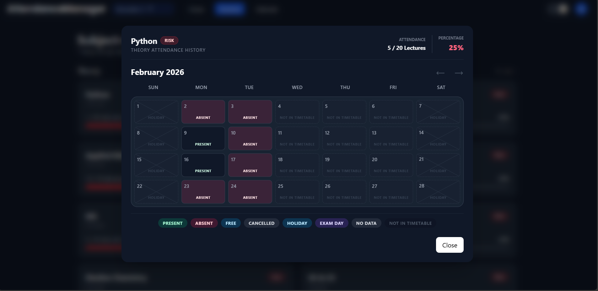

---

## ⚡ Quick Today's Attendance

Quickly mark attendance for all lectures scheduled on the current day without navigating through multiple screens.

Supported statuses for every scheduled lecture:

- ✅ Present
- ❌ Absent
- 🆓 Free Lecture
- 🚫 Cancelled Lecture

This makes daily attendance updates fast and effortless while keeping subject-wise statistics accurate.

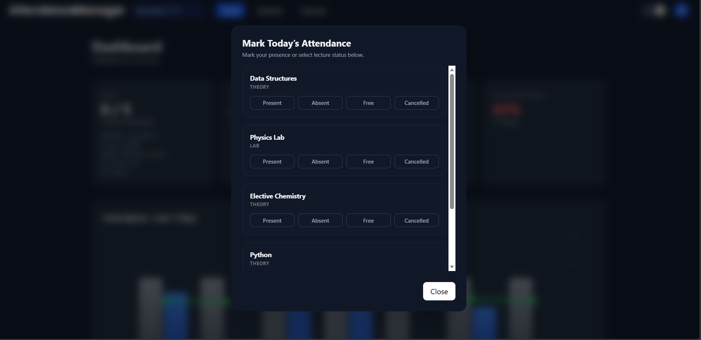

---

## 📝 Detailed Attendance Editor

Need to update attendance for a previous date or correct a missed entry?

The Detailed Attendance Editor allows you to mark each scheduled lecture individually with:

- ✅ Present
- ❌ Absent
- 🆓 Free Lecture
- 🚫 Cancelled Lecture

This makes it easy to correct attendance records or fill in days that were missed earlier.

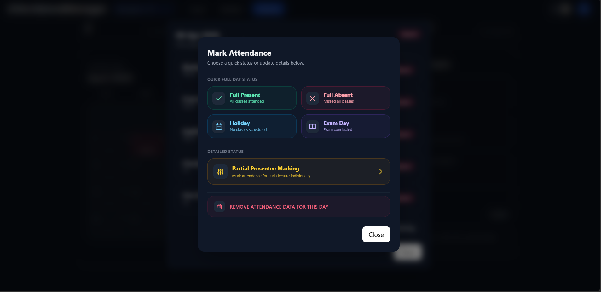

---

## 🗓 Attendance Calendar

A complete semester calendar with:

- Full Day
- Partial Day
- Absence
- Holiday
- Exam Day

along with monthly highlights and reminders.

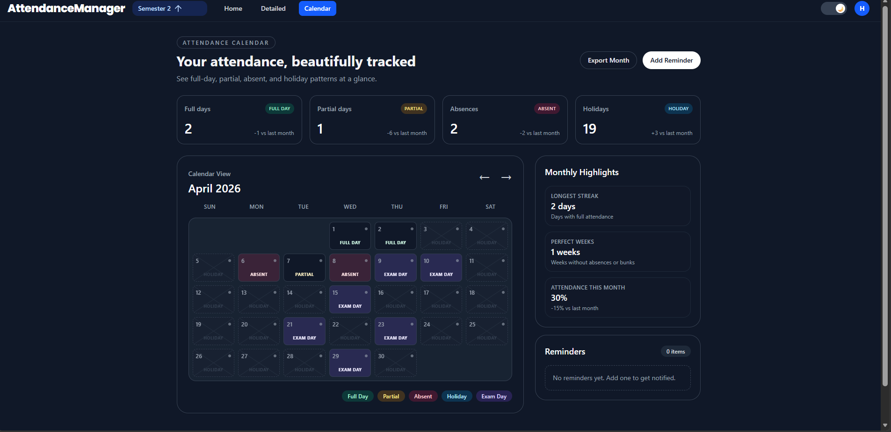

---

## ⏰ Reminder System

Create reminders for lectures, labs or important attendance events.

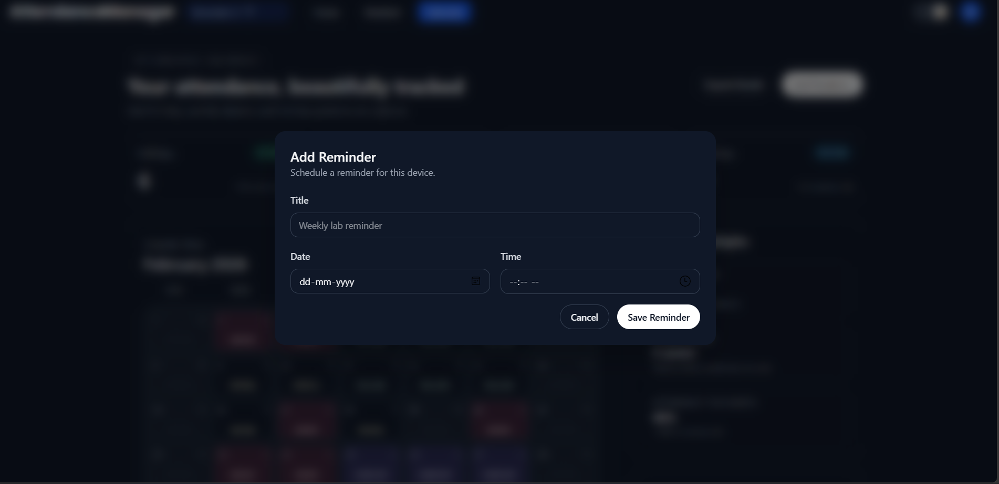

---

## 📄 Monthly Attendance Report

Export a printable attendance report containing:

- Calendar summary
- Overall attendance
- Classes conducted
- Detailed daily logs

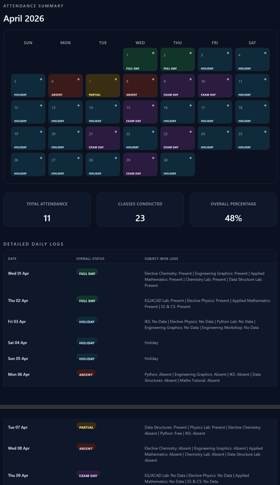

---

## ⚙ Timetable Management

Create and edit semester timetables with separate Theory and Lab subjects.

- Add/Delete subjects
- Weekly timetable editor
- Drag-free scheduling
- Multiple lectures per day

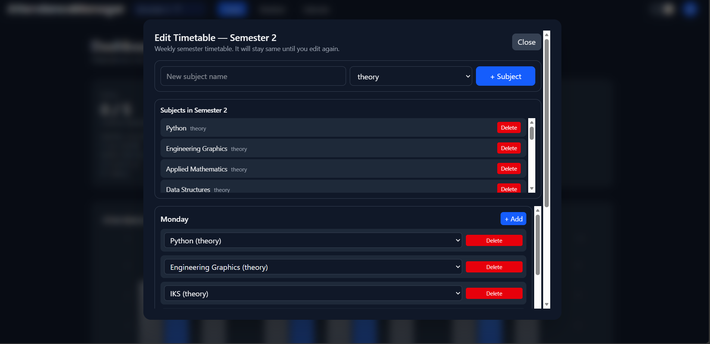

---

## 📂 Subject Selection

Choose any registered theory or lab subject while editing the timetable.

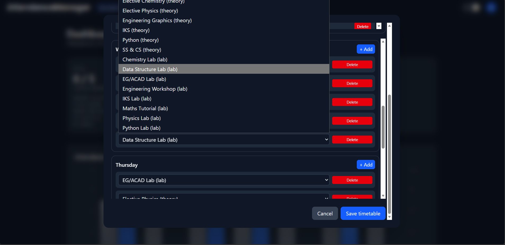

---

## 👤 User Profile

View account information, attendance summary, authentication provider and securely sign out.

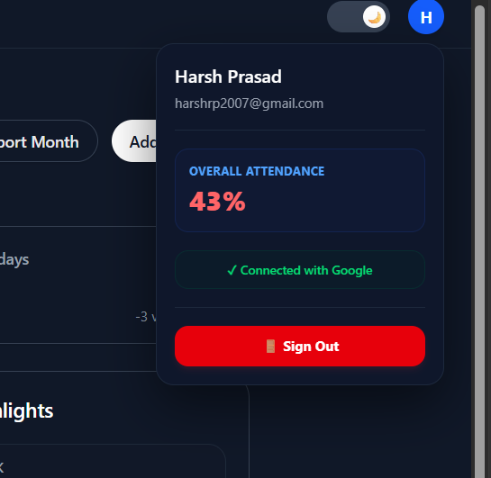

---

# 🚀 Getting Started

### Clone the repository

```bash
git clone https://github.com/harsh-pr/attendance-tracker.git
```

### Navigate to the project

```bash
cd attendance-tracker
```

### Install dependencies

```bash
npm install
```

### Configure Firebase

Create a `.env.local` file.

```env
VITE_FIREBASE_API_KEY=your_key
VITE_FIREBASE_AUTH_DOMAIN=your_domain
VITE_FIREBASE_PROJECT_ID=your_project
VITE_FIREBASE_STORAGE_BUCKET=your_bucket
VITE_FIREBASE_MESSAGING_SENDER_ID=your_sender_id
VITE_FIREBASE_APP_ID=your_app_id
```

### Start the development server

```bash
npm run dev
```

---

# 🧹 Database Maintenance

### Purge Leftover Data of Deleted Users

When you delete users from the Firebase Authentication Dashboard, their Firestore documents are not deleted automatically (due to decoupling). To clean up Firestore data of deleted users, run:

```bash
npm run clean-orphans
```

*Note: This script queries active UIDs using `serviceAccountKey.json` and recursively purges the Firestore documents and subcollections of any deleted users, keeping active data (and the default mock user) completely safe.*

---

# 📱 Responsive Design

Optimized for:

- 💻 Desktop
- 📱 Mobile
- 📟 Tablet

---

### ⭐ If you found this project useful, consider giving it a star on GitHub!