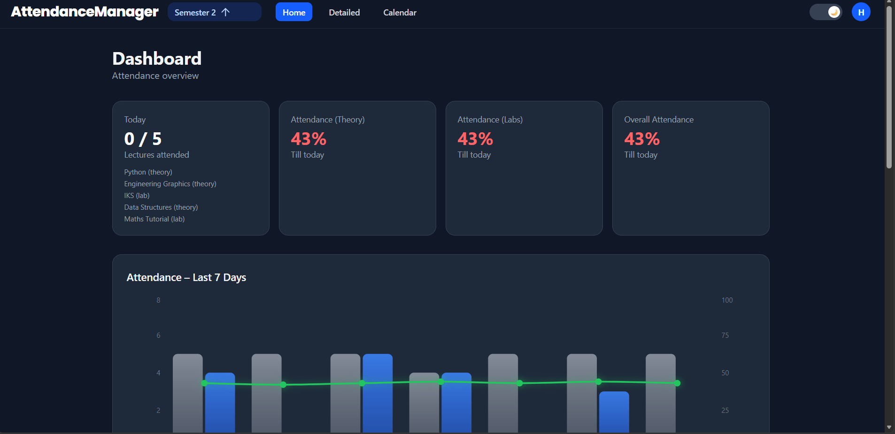
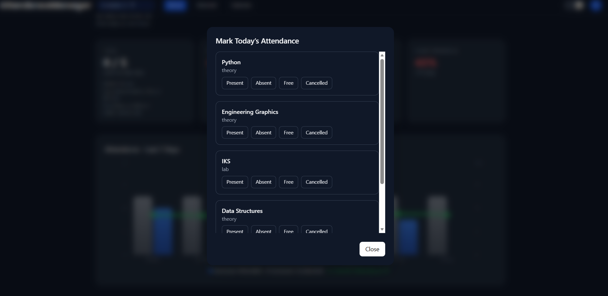
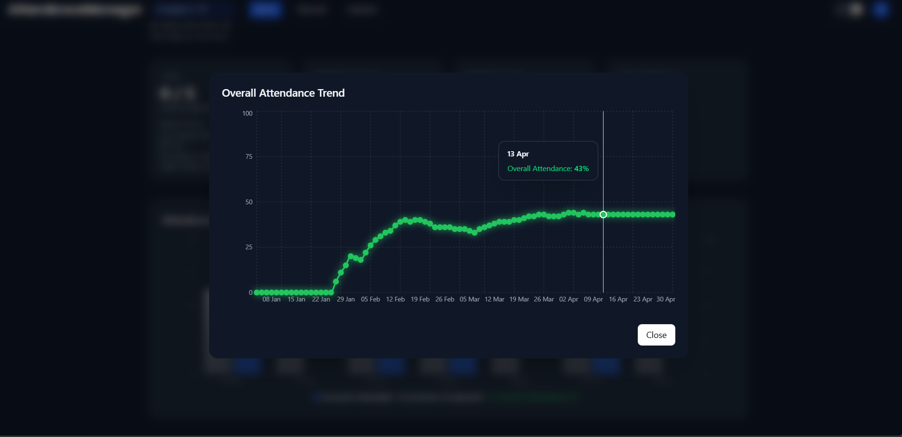
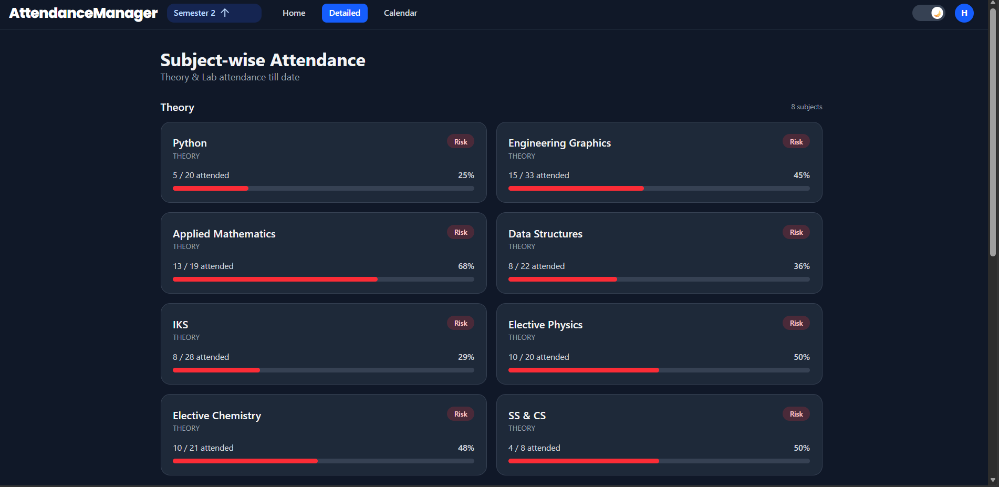
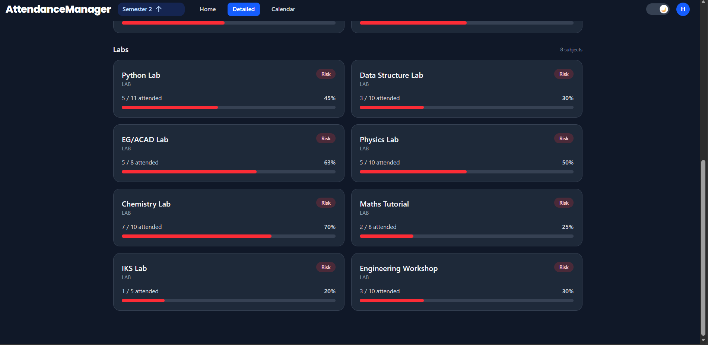
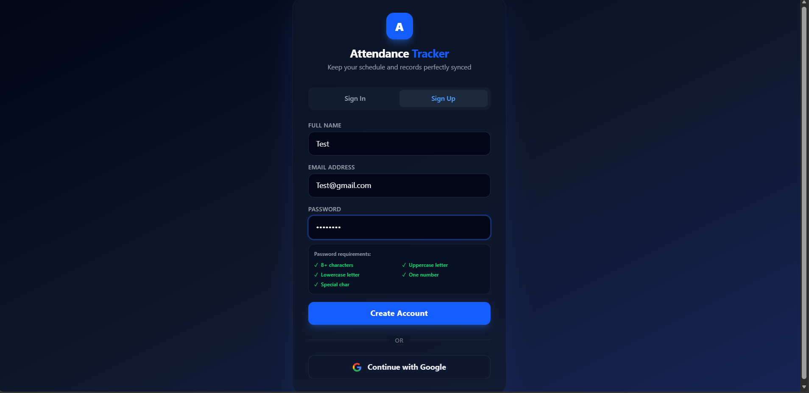

# 📚 AttendanceManager

<div align="center">


A modern, responsive attendance management application built with **React** and **Firebase** to help students effortlessly track attendance, monitor eligibility, and stay organized throughout the semester.

</div>

---

## ✨ Features

### 📅 Attendance Tracking

- Mark lectures as:
  - ✅ Present
  - ❌ Absent
  - 🟢 Free Lecture
  - ⚪ Cancelled
- Subject-wise attendance statistics
- Automatic attendance percentage calculation
- Daily attendance logging

---

### 📊 Attendance Analytics

- Overall attendance dashboard
- Interactive attendance graphs using Recharts
- Weekly attendance trends
- Subject-wise attendance breakdown
- Attendance history visualization

---

### 🎯 75% Attendance Calculator

Automatically calculates:

- Current attendance percentage
- Classes required to reach 75%
- Classes that can safely be skipped
- Real-time updates after every attendance entry

---

### 📆 Timetable Management

- Create semester timetable
- Weekly lecture scheduling
- Edit timetable anytime
- Holiday support
- Automatic lecture generation based on timetable

---

### 🗓 Calendar View

- Monthly attendance calendar
- Attendance history
- Holiday indicators
- Daily lecture summary
- PDF attendance export

---

### ⚡ Quick Attendance

- Fast popup attendance marking
- One-click lecture updates
- Optimized for mobile devices

---

### 🔔 Smart Reminders

- Lecture reminders
- Browser notifications
- Attendance alerts
- Custom reminder scheduling

---

### ☁ Cloud Sync

- Google Authentication
- Firebase Firestore
- Secure cloud backup
- Automatic synchronization across multiple devices
- Access your attendance anywhere after signing in

---

### 🌙 Modern UI

- Responsive design
- Dark & Light themes
- Smooth animations
- Mobile-first interface

---

# 🚀 Tech Stack

| Technology | Purpose |
|------------|---------|
| React | Frontend |
| React Router | Routing |
| Firebase Authentication | User Login |
| Cloud Firestore | Database |
| Framer Motion | Animations |
| Recharts | Charts & Analytics |
| jsPDF | PDF Export |
| html2canvas | PDF Screenshot Generation |

---

# 📂 Project Structure

```text
src/
│
├── components/
│   ├── AttendanceOverviewChart
│   ├── MobileNav
│   ├── Modal
│   ├── Navbar
│   ├── OverallAttendanceModal
│   ├── QuickTodayAttendance
│   ├── ReminderScheduler
│   ├── ThemeToggle
│   └── NotificationPermissionModal
│
├── pages/
│   ├── Home
│   ├── Today
│   ├── Calendar
│   ├── Auth
│   └── OnboardingSetup
│
├── context/
│   ├── AuthContext
│   ├── SemesterContext
│   └── ThemeContext
│
├── firebase/
│   ├── config
│   └── firestoreService
│
├── hooks/
│   └── useNotificationPermission
│
├── store/
│   └── attendanceStore
│
├── utils/
│   ├── attendanceUtils
│   └── timetableUtils
│
└── data/
    └── defaultSemesters
```

---

---

# 📸 Screenshots

> 🎬 **Demo GIF**
>
> *(Coming soon — I'll add a demo GIF here later.)*

---

## 🏠 Dashboard

Shows today's lectures, overall attendance, theory/lab breakdown, attendance graph, and recent attendance logs.



---

## 📅 Calendar View

Track full days, partial attendance, absences, holidays, exam days, reminders, and monthly highlights.


---

## ✅ Quick Attendance

Mark today's attendance in just a few clicks using the popup attendance window.



---

## 📈 Overall Attendance Trend

Interactive graph showing attendance progression throughout the semester.



---

## 📚 Subject-wise Attendance

Detailed attendance percentage for every theory and lab subject with risk indicators.

### Theory Subjects



### Lab Subjects



---

## 🗓 Timetable Editor

Create and edit your semester timetable with support for theory and lab subjects.


---

## 🔐 Authentication

Secure sign up and login using Firebase Authentication.



---

## 📄 Monthly Attendance Report

Export a complete monthly attendance summary as PDF.


---

# 🚀 Getting Started

### Clone the repository

```bash
git clone https://github.com/harsh-pr/attendance-tracker.git
```

### Navigate to the project

```bash
cd attendance-tracker
```

### Install dependencies

```bash
npm install
```

### Configure Firebase

Create a `.env.local` file.

```env
VITE_FIREBASE_API_KEY=your_key
VITE_FIREBASE_AUTH_DOMAIN=your_domain
VITE_FIREBASE_PROJECT_ID=your_project
VITE_FIREBASE_STORAGE_BUCKET=your_bucket
VITE_FIREBASE_MESSAGING_SENDER_ID=your_sender_id
VITE_FIREBASE_APP_ID=your_app_id
```

### Start the development server

```bash
npm run dev
```

---

# 📱 Responsive Design

Optimized for:

- 💻 Desktop
- 📱 Mobile
- 📟 Tablet

---

### ⭐ If you found this project useful, consider giving it a star on GitHub!